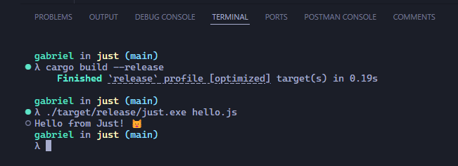

# Just

Just is a simple Rust application that allows you to execute JavaScript code using the V8 engine. It supports both REPL mode and executing JavaScript files.



## Installation

To use Just, you need to have Rust installed on your system. If you don't have Rust installed, you can get it from [rust-lang.org](https://www.rust-lang.org/).

Clone the repository and navigate to the project directory:

```sh
git clone https://github.com/gabrielalmir/just.git
cd just
```

Build the project using Cargo:

```sh
cargo build --release
```

## Usage

### REPL Mode

To start the REPL mode, simply run the compiled binary without any arguments:

```sh
cargo run --release
```

You can then enter JavaScript code, and it will be executed using the V8 engine. Type `exit` to quit the REPL.

### Execute JavaScript File

To execute a JavaScript file, provide the file path as an argument:

```sh
cargo run --release path/to/your/file.js
```

## Dependencies

Just relies on the following dependencies:

- `rusty_v8`: Rust bindings for the V8 JavaScript engine.
- `tokio`: An asynchronous runtime for Rust.

These dependencies are specified in the `Cargo.toml` file.

## License

This project is licensed under the MIT License. See the [LICENSE](LICENSE) file for details.

## Contributing

Contributions are welcome! Please open an issue or submit a pull request on GitHub.

## Acknowledgements

- [rusty_v8](https://github.com/denoland/rusty_v8) for providing the Rust bindings for V8.
- The Rust community for their continuous support and contributions.
